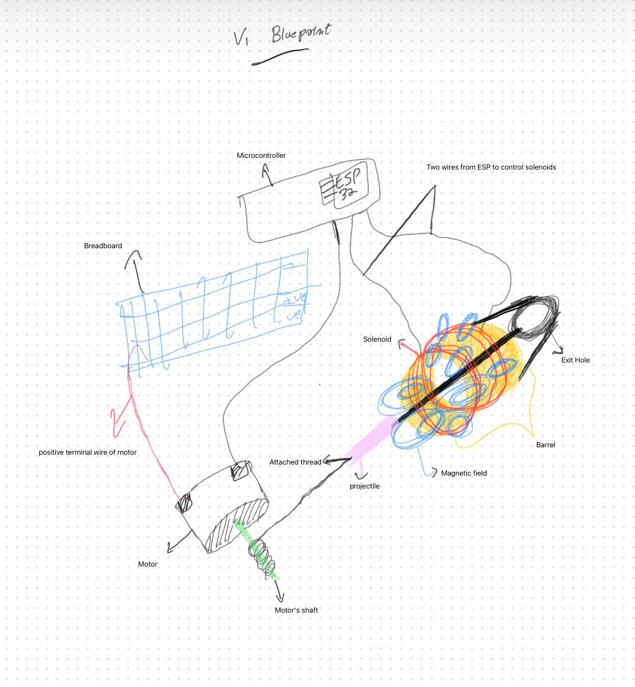
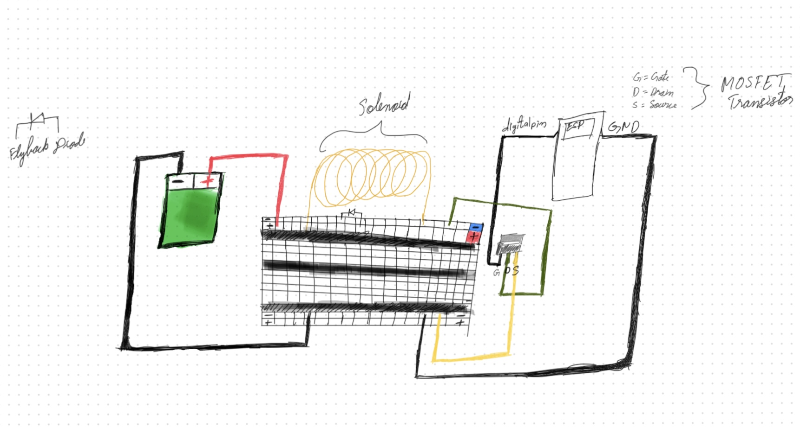

# Web-Shooter (v3.3.0)
> A wrist-mounted electromagnetic web-shooter powered by an ESP32 and magnetic induction.

---

##  How It Works

This project uses the principle of **Electromagnetic Induction** — when current flows through a coiled conductor, it generates a magnetic field. That field is used to sequentially launch an iron rod attached to a thread (the "web") forward at high speed when a trigger button is pressed.

---

##  Components

| Component | Purpose |
|---|---|
| **ESP32** | System brain — processes non-blocking trigger states and governs the high-speed sequential launch timing |
| **Iron Rod** | The projectile — accelerated and launched via electromagnetic forces |
| **Non-Magnetic Rod** | Guide rail — keeps the iron rod perfectly aligned during the launch sequence |
| **Solenoid (coiled wire)** | Multi-stage coils wound around the barrel — generates the firing magnetic fields when energized |
| **Breadboard** | Used for rapid prototyping and anchoring user interface button controls |
| **Trigger Button** | Hardware input — initiates the asynchronous sequential launch cycle |
| **Plastic Bottle Chassis** | Main physical frame housing all structural components and electronics |
| **Motor Axle** | Active spooling system — un-winds the thread actively to remove friction and deployment limits |
| **Transistor (MOSFET)** | Electronic switch — interfaces logic pins to switch heavy current directly to the solenoids |
| **Flyback Diode** | Protection circuit — redirects high-voltage inductive spikes safely back across the coils on cutoff |

---

##  System Diagram

Below is the complete physical design and component layout of the Web-Shooter, showing how all structural elements integrate.

  
  
<i>Official Hand-Drawn System Schematic</i>

---

##  Solenoid Wiring Detail

To safely handle the high current required by the induction coils without damaging the ESP32, follow this official wiring configuration layout. 

This is how you should wire a solenoid: The diagram below provides a clear visualization of the high-current section, highlighting how to correctly route the power source using the **MOSFET** as a high-speed electronic switch (connecting Gate to the digital pin, Drain to the solenoid low-side, and Source to common Ground), along with the specific placement of the **Flyback Diode** parallel across the solenoid terminals to neutralize induction voltage spikes.

  
  
<i>Official Solenoid and MOSFET Wiring Schematic</i>

---

## Basic Principle — Electromagnetic Induction

When electric current passes through a **solenoid** (a coil of wire), it creates a concentrated magnetic field along its axis. A ferromagnetic object (like an iron rod) placed inside the coil experiences a strong attractive force toward the center of the field.

By controlling the **duration and timing** of the current pulse via the ESP32, the rod is accelerated and ejected — mimicking a railgun-style launch mechanism in a compact, wrist-mounted form.

---

## Firmware Features (v3.3.0)

Written in **Arduino-style C++** compiled and flashed via the **Arduino IDE with ESP32 board support**.

* **Asynchronous Non-Blocking Logic:** Completely eliminated blocking `delay()` statements across the codebase in favor of a clean `millis()` state machine architecture, ensuring zero runtime latency.
* **3-Stage Sequential Control:** Manages independent execution gates for a precise three-coil induction progression to optimize projectile travel velocity.
* **Hardcoded Safety Interlocks:**
    * *5-Second Maximum Duty Cycle:* Automatic fail-safe cutoff prevents continuous coil engagement and potential thermal runaways.
    * *Hardware Kill Switch:* Global reset routing instantly cuts gate control to all low-side switches.
    * *Button Release Restraint:* Firing sequence logic forces an explicit button release before re-arming the execution state.

---

• Concept inspired from **electromagnetic induction**

• Idea Inspired from the movie: **Spiderman: into the Spider Verse**
