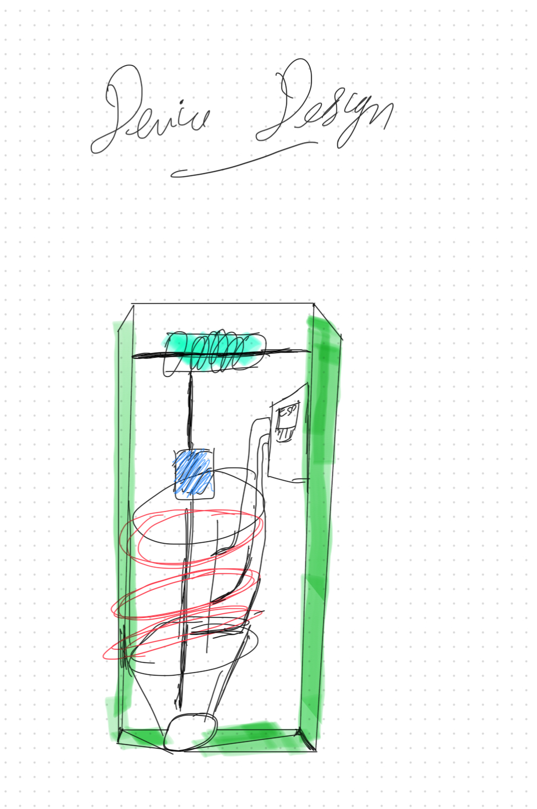

# Web-Shooter (v2.0.0)
> A compact, hardware-driven web-shooter prototyping sequential multi-solenoid deployment based on electromagnetic induction.

---

## How It Works

The core concept driving this project is **Electromagnetic Induction**. When the microcontroller activates the circuit, current surges through the solenoid coils, inducing a strong localized magnetic field. This magnetic force creates a linear pull on the ferromagnetic projectile located inside the barrel.

1. **Coil Excitation:** The microprocessor pulses current through the solenoids, instantly turning them into electromagnets.
2. **Kinetic Launch:** Driven by electromagnetic induction, the iron projectile is pulled forward and launched out of the front exit nozzle.
3. **Passive Spooling:** Powered entirely by the forward kinetic energy of the flying projectile, the rear cardboard barrel rotates rapidly on its fixed axle, smoothly un-winding the coiled thread to simulate a flying web string.

---

## System Blueprints

### Physical Framework & Enclosure
The internal architecture maps out how the central spooling core, active electronics housing, and primary accelerator barrel fit together inside the chassis.

  
  
<i>Internal Device Assembly Blueprint</i>

### Linear Kinetic Mechanics
The functional layout details the linear alignment of the fixed rolling barrel, the trailing thread path, and the path of inertia through the forward electromagnetic coils.

  
  
<i>Component Layout and Direction of Inertia Blueprint</i>

---

## Components

| Component | Physical Description / Purpose |
|---|---|
| **Microcontroller (ESP32)** | Governs high-speed power delivery timing across the electronic switching grid. |
| **Iron Projectile (Nail)** | Ferromagnetic core acting as the high-velocity kinetic anchor for the thread. |
| **Fixed Rolling Barrel** | Repurposed lightweight cylindrical barrel containing the spooled thread supply; spins freely to eliminate drag. |
| **Fixed Support Rod** | Axle anchor ensuring the spooling barrel rotates along a stable, true rotational path. |
| **Solenoid Arrays** | Insulated copper windings wrapped tightly around the flight barrel to induce forward magnetic acceleration. |
| **Thread Network ("Web")** | High-tensile line pre-wound around the rolling barrel and fixed securely to the tail of the iron projectile. |
| **Chassis Assembly** | Lightweight protective structure containing and insulating the high-frequency switching lines. |

---

## Core Principles

* **Electromagnetic Induction & Attraction:** Passing current through the solenoid coils produces a dense magnetic flux field concentrated along the central barrel axis. The iron projectile reacts instantly to this magnetic gradient, translating electrical energy into linear kinetic movement.
* **Rotational Kinetic Energy Transfer:** As the projectile exits the device with high velocity, the tension on the trailing line converts linear momentum into rotational torque. This causes the low-mass cardboard barrel to spin, ensuring continuous, unhindered web deployment.

---

* Concept inspired from electromagnetic induction
* Idea Inspired from the movie: Spiderman: into the Spider Verse
